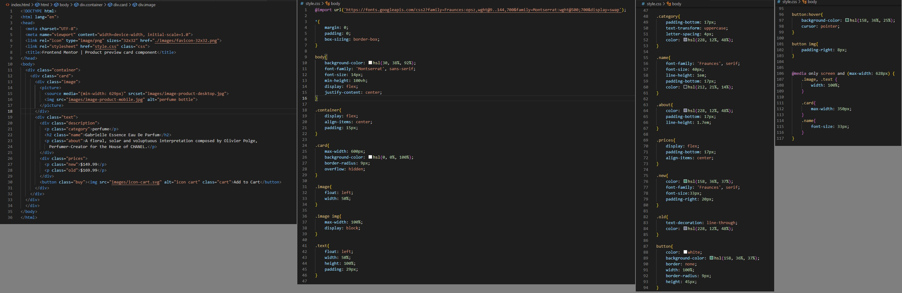

# Frontend Mentor - Product preview card component solution

This is a solution to the [Product preview card component challenge on Frontend Mentor](https://www.frontendmentor.io/challenges/product-preview-card-component-GO7UmttRfa). Frontend Mentor challenges help you improve your coding skills by building realistic projects. 

## Table of contents

- [Overview](#overview)
  - [The challenge](#the-challenge)
  - [Screenshot](#screenshot)
  - [Links](#links)
- [My process](#my-process)
  - [Built with](#built-with)
  - [What I learned](#what-i-learned)
  - [Useful resources](#useful-resources)
- [Author](#author)

**Note: Delete this note and update the table of contents based on what sections you keep.**

## Overview

### The challenge

Users should be able to:

- View the optimal layout depending on their device's screen size
- See hover and focus states for interactive elements

### Screenshot

### Links

- Solution URL: (https://github.com/GeorgeHenriqueDias/productpreviewcard)
- Live Site URL: (https://georgehenriquedias.github.io/productpreviewcard/)

## My process

### Built with

- Semantic HTML5 markup
- CSS custom properties

### What I learned

I have learned a lot with this one. Mostly about CSS properties. How to dinamicaly change the layout of the page using the 'float' property and then configuring it for different sizes of screens.

I am proud of the result, and realy proud of my growth.

### Useful resources

- [Tutorial Republic](https://www.tutorialrepublic.com/faq/how-to-remove-white-space-under-an-image-using-css.php) - This helped me on removing a space under the image.
- [W3Schools](https://www.w3schools.com/cssref/pr_text_text-transform.php) - This helped me format some text using CSS.
- [CSS Reference](https://cssreference.io/property/letter-spacing/) - This helped me format some text using CSS.
- [W3](https://www.w3.org/Style/Examples/007/units.en.html) - This helped me format some text using CSS.
- [Mozila](https://developer.mozilla.org/en-US/docs/Web/CSS/text-decoration) - This helped me format some text using CSS.
- [Stack Overflow](https://stackoverflow.com/questions/4114552/how-to-remove-the-bottom-border-of-a-box-with-css) - This show me how to deal with some borders.
- [W3Schools](https://www.w3schools.com/cssref/sel_hover.php) - This showed me how to modify the button on hover.

## Author

- Frontend Mentor - [@GeorgeHenriqueDias](https://www.frontendmentor.io/profile/GeorgeHenriqueDias)
- Twitter - [@georgehenridias](https://www.twitter.com/georgehenridias)